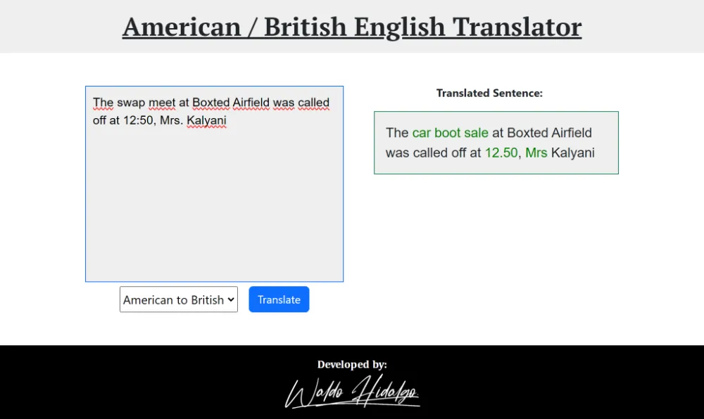

# American British Translator

[Quinto y último proyecto](https://www.freecodecamp.org/learn/quality-assurance/quality-assurance-projects/american-british-translator) finalizado y aprobado el cual es requisito obligatorio para obtener la **Quality Assurance Certification** de freecodecamp.

El proyecto consiste en realizar un traductor de inglés americano a inglés británico y viceversa. El traductor **NO** traduce cualquier palabra y/o frase sino un **dominio** acotado a **2131 palabras y frases** las cuales se encuentran en los archivos ubicados en la carpeta **components** llamados:

- american-only.js (183 palabras y frases)

- american-to-british-spelling.js (1699 palabras)

- american-to-british-titles.js (6 palabras)

- british-only.js (243 palabras y frases)

El texto a traducir y el idioma se envían desde el cliente al servidor en el cuerpo de una petición POST en formato de objeto siendo el valor de la key **text** igual al texto que se desea traducir y el valor de la key **locale** igual a **british-to-american** o **american-to-british**. El servidor responde con diversos mensajes según corresponda:

- 1. Cuando el texto ingresado posee traducción, dicha traducción se muestra en el área marcada para ello. El servidor responde con un objeto siendo el valor de la key **text** igual al texto a traducir enviado y el valor de la key **translation** igual al texto traducido.

- 2. Si el texto esta en un idioma y se intenta traducir al mismo idioma entonces se envía lo siguiente:

     > Everything looks good to me!

- 3. Si el texto que se desea traducir esta en blanco, entonces se envía el siguiente error:

     > { error: 'No text to translate' }

- 4. Si se pretende traducir a un idioma distinto del inglés americano o inglés británico pasando un argumento diferente de **british-to-american** o **american-to-british**, entonces se envía el siguiente error:

     > { error: 'Invalid value for locale field' }.

- 5. Si en la petición al servidor no estan presentes las keys **text** o **locale**, entonces se envía el siguiente error:

     > { error: 'Required field(s) missing' }.

## Tabla de Contenidos

- [American British Translator](#american-british-translator)
  - [Tabla de Contenidos](#tabla-de-contenidos)
  - [Deploy](#deploy)
  - [Requisitos Aprobados](#requisitos-aprobados)
  - [Tests unitarios y funcionales requeridos](#tests-unitarios-y-funcionales-requeridos)
  - [Proyecto Aprobado](#proyecto-aprobado)
  - [Tests Requeridos Aprobados](#tests-requeridos-aprobados)
  - [Código de tests unitarios y funcionales](#código-de-tests-unitarios-y-funcionales)
    - [1. Tests Unitarios](#1-tests-unitarios)
      - [1. Translate Mangoes are my favorite fruit. to British English](#1-translate-mangoes-are-my-favorite-fruit-to-british-english)
      - [2.Translate I ate yogurt for breakfast. to British English](#2translate-i-ate-yogurt-for-breakfast-to-british-english)
      - [3.Translate We had a party at my friend's condo. to British English](#3translate-we-had-a-party-at-my-friends-condo-to-british-english)
      - [4.Translate Can you toss this in the trashcan for me? to British English](#4translate-can-you-toss-this-in-the-trashcan-for-me-to-british-english)
      - [5.Translate The parking lot was full. to British English](#5translate-the-parking-lot-was-full-to-british-english)
      - [6.Translate Like a high tech Rube Goldberg machine. to British English](#6translate-like-a-high-tech-rube-goldberg-machine-to-british-english)
      - [7.Translate To play hooky means to skip class or work. to British English](#7translate-to-play-hooky-means-to-skip-class-or-work-to-british-english)
      - [8.Translate No Mr. Bond, I expect you to die. to British English](#8translate-no-mr-bond-i-expect-you-to-die-to-british-english)
      - [9.Translate Dr. Grosh will see you now. to British English](#9translate-dr-grosh-will-see-you-now-to-british-english)
      - [10.Translate Lunch is at 12:15 today. to British English](#10translate-lunch-is-at-1215-today-to-british-english)
      - [11.Translate We watched the footie match for a while. to American English](#11translate-we-watched-the-footie-match-for-a-while-to-american-english)
      - [12.Translate Paracetamol takes up to an hour to work. to American English](#12translate-paracetamol-takes-up-to-an-hour-to-work-to-american-english)
      - [13.Translate First, caramelise the onions. to American English](#13translate-first-caramelise-the-onions-to-american-english)
      - [14.Translate I spent the bank holiday at the funfair. to American English](#14translate-i-spent-the-bank-holiday-at-the-funfair-to-american-english)
      - [15.Translate I had a bicky then went to the chippy. to American English](#15translate-i-had-a-bicky-then-went-to-the-chippy-to-american-english)
      - [16.Translate I've just got bits and bobs in my bum bag. to American English](#16translate-ive-just-got-bits-and-bobs-in-my-bum-bag-to-american-english)
      - [17.Translate The car boot sale at Boxted Airfield was called off. to American English](#17translate-the-car-boot-sale-at-boxted-airfield-was-called-off-to-american-english)
      - [18.Translate Have you met Mrs Kalyani? to American English](#18translate-have-you-met-mrs-kalyani-to-american-english)
      - [19.Translate Prof Joyner of King's College, London. to American English](#19translate-prof-joyner-of-kings-college-london-to-american-english)
      - [20.Translate Tea time is usually around 4 or 4.30. to American English](#20translate-tea-time-is-usually-around-4-or-430-to-american-english)
      - [21.Highlight translation in Mangoes are my favorite fruit.](#21highlight-translation-in-mangoes-are-my-favorite-fruit)
      - [22.Highlight translation in I ate yogurt for breakfast.](#22highlight-translation-in-i-ate-yogurt-for-breakfast)
      - [23.Highlight translation in We watched the footie match for a while.](#23highlight-translation-in-we-watched-the-footie-match-for-a-while)
      - [24.Highlight translation in Paracetamol takes up to an hour to work.](#24highlight-translation-in-paracetamol-takes-up-to-an-hour-to-work)
    - [2. Tests Funcionales](#2-tests-funcionales)
      - [1.Translation with text and locale fields: POST request to /api/translate](#1translation-with-text-and-locale-fields-post-request-to-apitranslate)
      - [2.Translation with text and invalid locale field: POST request to /api/translate](#2translation-with-text-and-invalid-locale-field-post-request-to-apitranslate)
      - [3.Translation with missing text field: POST request to /api/translate](#3translation-with-missing-text-field-post-request-to-apitranslate)
      - [4.Translation with missing locale field: POST request to /api/translate](#4translation-with-missing-locale-field-post-request-to-apitranslate)
      - [5.Translation with empty text: POST request to /api/translate](#5translation-with-empty-text-post-request-to-apitranslate)
      - [6.Translation with text that needs no translation: POST request to /api/translate](#6translation-with-text-that-needs-no-translation-post-request-to-apitranslate)
  - [Screenshots](#screenshots)
    - [1. Home: Inital State](#1-home-inital-state)
    - [2. British to American Translation](#2-british-to-american-translation)
    - [3. American to British Translation](#3-american-to-british-translation)
    - [4. American to American Translation (same)](#4-american-to-american-translation-same)
    - [5. British to British Translation (same)](#5-british-to-british-translation-same)
    - [6. Blank Translate Error](#6-blank-translate-error)

## Deploy

El proyecto ha sido desplegado a la web en mi cuenta gratuita en Render.com. Como es costumbre con Render.com, cuando un servicio web no esta activo, es decir, pasa un tiempo sin uso, dicho servicio es congelado necesitando de al menos 50 segundos o más para volver a visualizar el proyecto.

## Requisitos Aprobados


## Tests unitarios y funcionales requeridos


## Proyecto Aprobado


## Tests Requeridos Aprobados


## Código de tests unitarios y funcionales

Se han creado 24 tests unitarios y 6 tests funcionales requeridos:

### 1. Tests Unitarios

#### 1. Translate Mangoes are my favorite fruit. to British English

```js
test("Translate Mangoes are my favorite fruit. to British English", (done) => {
  assert.equal(
    translator.translate(
      "Mangoes are my favorite fruit.",
      "american-to-british",
      false
    ),
    "Mangoes are my favourite fruit."
  );
  done();
});
```

#### 2.Translate I ate yogurt for breakfast. to British English

```js
test("Translate I ate yogurt for breakfast. to British English", (done) => {
  assert.equal(
    translator.translate(
      "I ate yogurt for breakfast.",
      "american-to-british",
      false
    ),
    "I ate yoghurt for breakfast."
  );
  done();
});
```

#### 3.Translate We had a party at my friend's condo. to British English

```js
test("Translate We had a party at my friend's condo. to British English", (done) => {
  assert.equal(
    translator.translate(
      "We had a party at my friend's condo.",
      "american-to-british",
      false
    ),
    "We had a party at my friend's flat."
  );
  done();
});
```

#### 4.Translate Can you toss this in the trashcan for me? to British English

```js
test("Translate Can you toss this in the trashcan for me? to British English", (done) => {
  assert.equal(
    translator.translate(
      "Can you toss this in the trashcan for me?",
      "american-to-british",
      false
    ),
    "Can you toss this in the bin for me?"
  );
  done();
});
```

#### 5.Translate The parking lot was full. to British English

```js
test("Translate The parking lot was full. to British English", (done) => {
  assert.equal(
    translator.translate(
      "The parking lot was full.",
      "american-to-british",
      false
    ),
    "The car park was full."
  );
  done();
});
```

#### 6.Translate Like a high tech Rube Goldberg machine. to British English

```js
test("Translate Like a high tech Rube Goldberg machine. to British English", (done) => {
  assert.equal(
    translator.translate(
      "Like a high tech Rube Goldberg machine.",
      "american-to-british",
      false
    ),
    "Like a high tech Heath Robinson device."
  );
  done();
});
```

#### 7.Translate To play hooky means to skip class or work. to British English

```js
test("Translate To play hooky means to skip class or work. to British English", (done) => {
  assert.equal(
    translator.translate(
      "To play hooky means to skip class or work.",
      "american-to-british",
      false
    ),
    "To bunk off means to skip class or work."
  );
  done();
});
```

#### 8.Translate No Mr. Bond, I expect you to die. to British English

```js
test("Translate No Mr. Bond, I expect you to die. to British English", (done) => {
  assert.equal(
    translator.translate(
      "No Mr. Bond, I expect you to die.",
      "american-to-british",
      false
    ),
    "No Mr Bond, I expect you to die."
  );
  done();
});
```

#### 9.Translate Dr. Grosh will see you now. to British English

```js
test("Translate Dr. Grosh will see you now. to British English", (done) => {
  assert.equal(
    translator.translate(
      "Dr. Grosh will see you now.",
      "american-to-british",
      false
    ),
    "Dr Grosh will see you now."
  );
  done();
});
```

#### 10.Translate Lunch is at 12:15 today. to British English

```js
test("Translate Lunch is at 12:15 today. to British English", (done) => {
  assert.equal(
    translator.translate(
      "Lunch is at 12:15 today.",
      "american-to-british",
      false
    ),
    "Lunch is at 12.15 today."
  );
  done();
});
```

#### 11.Translate We watched the footie match for a while. to American English

```js
test("Translate We watched the footie match for a while. to American English", (done) => {
  assert.equal(
    translator.translate(
      "We watched the footie match for a while.",
      "british-to-american",
      false
    ),
    "We watched the soccer match for a while."
  );
  done();
});
```

#### 12.Translate Paracetamol takes up to an hour to work. to American English

```js
test("Translate Paracetamol takes up to an hour to work. to American English", (done) => {
  assert.equal(
    translator.translate(
      "Paracetamol takes up to an hour to work.",
      "british-to-american",
      false
    ),
    "Tylenol takes up to an hour to work."
  );
  done();
});
```

#### 13.Translate First, caramelise the onions. to American English

```js
test("Translate First, caramelise the onions. to American English", (done) => {
  assert.equal(
    translator.translate(
      "First, caramelise the onions.",
      "british-to-american",
      false
    ),
    "First, caramelize the onions."
  );
  done();
});
```

#### 14.Translate I spent the bank holiday at the funfair. to American English

```js
test("Translate I spent the bank holiday at the funfair. to American English", (done) => {
  assert.equal(
    translator.translate(
      "I spent the bank holiday at the funfair.",
      "british-to-american",
      false
    ),
    "I spent the public holiday at the carnival."
  );
  done();
});
```

#### 15.Translate I had a bicky then went to the chippy. to American English

```js
test("Translate I had a bicky then went to the chippy. to American English", (done) => {
  assert.equal(
    translator.translate(
      "I had a bicky then went to the chippy.",
      "british-to-american",
      false
    ),
    "I had a cookie then went to the fish-and-chip shop."
  );
  done();
});
```

#### 16.Translate I've just got bits and bobs in my bum bag. to American English

```js
test("Translate I've just got bits and bobs in my bum bag. to American English", (done) => {
  assert.equal(
    translator.translate(
      "I've just got bits and bobs in my bum bag.",
      "british-to-american",
      false
    ),
    "I've just got odds and ends in my fanny pack."
  );
  done();
});
```

#### 17.Translate The car boot sale at Boxted Airfield was called off. to American English

```js
test("Translate The car boot sale at Boxted Airfield was called off. to American English", (done) => {
  assert.equal(
    translator.translate(
      "The car boot sale at Boxted Airfield was called off.",
      "british-to-american",
      false
    ),
    "The swap meet at Boxted Airfield was called off."
  );
  done();
});
```

#### 18.Translate Have you met Mrs Kalyani? to American English

```js
test("Translate Have you met Mrs Kalyani? to American English", (done) => {
  assert.equal(
    translator.translate(
      "Have you met Mrs Kalyani?",
      "british-to-american",
      false
    ),
    "Have you met Mrs. Kalyani?"
  );
  done();
});
```

#### 19.Translate Prof Joyner of King's College, London. to American English

```js
test("Translate Prof Joyner of King's College, London. to American English", (done) => {
  assert.equal(
    translator.translate(
      "Prof Joyner of King's College, London.",
      "british-to-american",
      false
    ),
    "Prof. Joyner of King's College, London."
  );
  done();
});
```

#### 20.Translate Tea time is usually around 4 or 4.30. to American English

```js
test("Translate Tea time is usually around 4 or 4.30. to American English", (done) => {
  assert.equal(
    translator.translate(
      "Tea time is usually around 4 or 4.30.",
      "british-to-american",
      false
    ),
    "Tea time is usually around 4 or 4:30."
  );
  done();
});
```

#### 21.Highlight translation in Mangoes are my favorite fruit.

```js
test("Highlight translation in Mangoes are my favorite fruit.", (done) => {
  assert.equal(
    translator.translate(
      "Mangoes are my favorite fruit.",
      "american-to-british",
      true
    ),
    'Mangoes are my <span class="highlight">favourite</span> fruit.'
  );
  done();
});
```

#### 22.Highlight translation in I ate yogurt for breakfast.

```js
test("Highlight translation in I ate yogurt for breakfast.", (done) => {
  assert.equal(
    translator.translate(
      "I ate yogurt for breakfast.",
      "american-to-british",
      true
    ),
    'I ate <span class="highlight">yoghurt</span> for breakfast.'
  );
  done();
});
```

#### 23.Highlight translation in We watched the footie match for a while.

```js
test("Highlight translation in We watched the footie match for a while.", (done) => {
  assert.equal(
    translator.translate(
      "We watched the footie match for a while.",
      "british-to-american",
      true
    ),
    'We watched the <span class="highlight">soccer</span> match for a while.'
  );
  done();
});
```

#### 24.Highlight translation in Paracetamol takes up to an hour to work.

```js
test("Highlight translation in Paracetamol takes up to an hour to work.", (done) => {
  assert.equal(
    translator.translate(
      "Paracetamol takes up to an hour to work.",
      "british-to-american",
      true
    ),
    '<span class="highlight">Tylenol</span> takes up to an hour to work.'
  );
  done();
});
```

### 2. Tests Funcionales

#### 1.Translation with text and locale fields: POST request to /api/translate

```js
test("Translation with text and locale fields: POST request to /api/translate", (done) => {
  chai
    .request(server)
    .keepOpen()
    .post("/api/translate")
    .send({
      text: "Mangoes are my favorite fruit.",
      locale: "american-to-british",
    })
    .end((err, res) => {
      assert.equal(res.status, 200);
      assert.equal(res.body.text, "Mangoes are my favorite fruit.");
      assert.equal(
        res.body.translation,
        'Mangoes are my <span class="highlight">favourite</span> fruit.'
      );
      done();
    });
});
```

#### 2.Translation with text and invalid locale field: POST request to /api/translate

```js
test("Translation with text and invalid locale field: POST request to /api/translate", (done) => {
  chai
    .request(server)
    .keepOpen()
    .post("/api/translate")
    .send({
      text: "Mangoes are my favorite fruit.",
      locale: "american-to-spanish",
    })
    .end((err, res) => {
      assert.equal(res.status, 200);
      assert.equal(res.body.error, "Invalid value for locale field");
      done();
    });
});
```

#### 3.Translation with missing text field: POST request to /api/translate

```js
test("Translation with missing text field: POST request to /api/translate", (done) => {
  chai
    .request(server)
    .keepOpen()
    .post("/api/translate")
    .send({
      locale: "american-to-british",
    })
    .end((err, res) => {
      assert.equal(res.status, 200);
      assert.equal(res.body.error, "Required field(s) missing");
      done();
    });
});
```

#### 4.Translation with missing locale field: POST request to /api/translate

```js
test("Translation with missing locale field: POST request to /api/translate", (done) => {
  chai
    .request(server)
    .keepOpen()
    .post("/api/translate")
    .send({
      text: "Mangoes are my favorite fruit.",
    })
    .end((err, res) => {
      assert.equal(res.status, 200);
      assert.equal(res.body.error, "Required field(s) missing");
      done();
    });
});
```

#### 5.Translation with empty text: POST request to /api/translate

```js
test("Translation with empty text: POST request to /api/translate", (done) => {
  chai
    .request(server)
    .keepOpen()
    .post("/api/translate")
    .send({
      text: "",
      locale: "american-to-british",
    })
    .end((err, res) => {
      assert.equal(res.status, 200);
      assert.equal(res.body.error, "No text to translate");
      done();
    });
});
```

#### 6.Translation with text that needs no translation: POST request to /api/translate

```js
test("Translation with text that needs no translation: POST request to /api/translate", (done) => {
  chai
    .request(server)
    .keepOpen()
    .post("/api/translate")
    .send({
      text: "Mangoes are my favorite fruit.",
      locale: "british-to-american",
    })
    .end((err, res) => {
      assert.equal(res.status, 200);
      assert.equal(res.body.text, "Mangoes are my favorite fruit.");
      assert.equal(res.body.translation, "Everything looks good to me!");
      done();
    });
});
```

## Screenshots

### 1. Home: Inital State


### 2. British to American Translation


### 3. American to British Translation



### 4. American to American Translation (same)


### 5. British to British Translation (same)


### 6. Blank Translate Error


